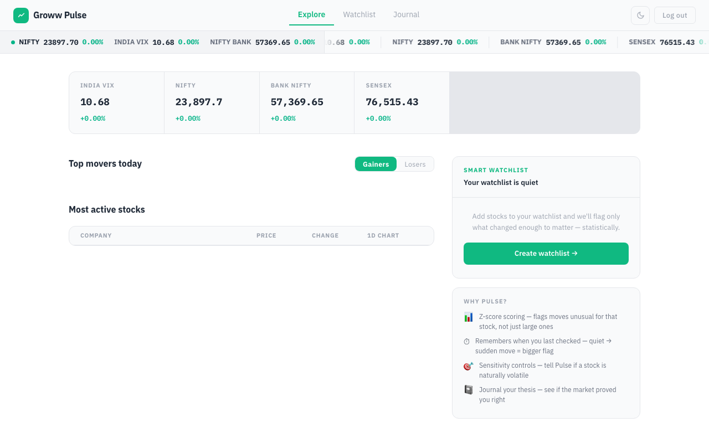
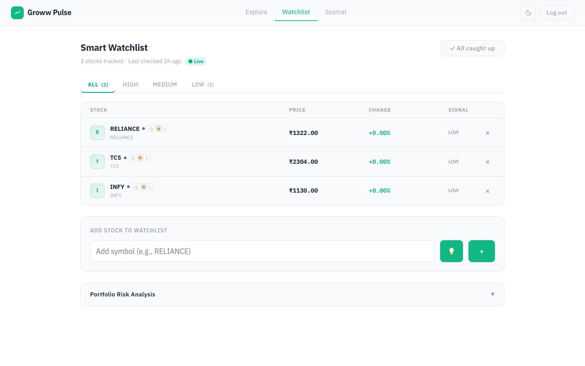
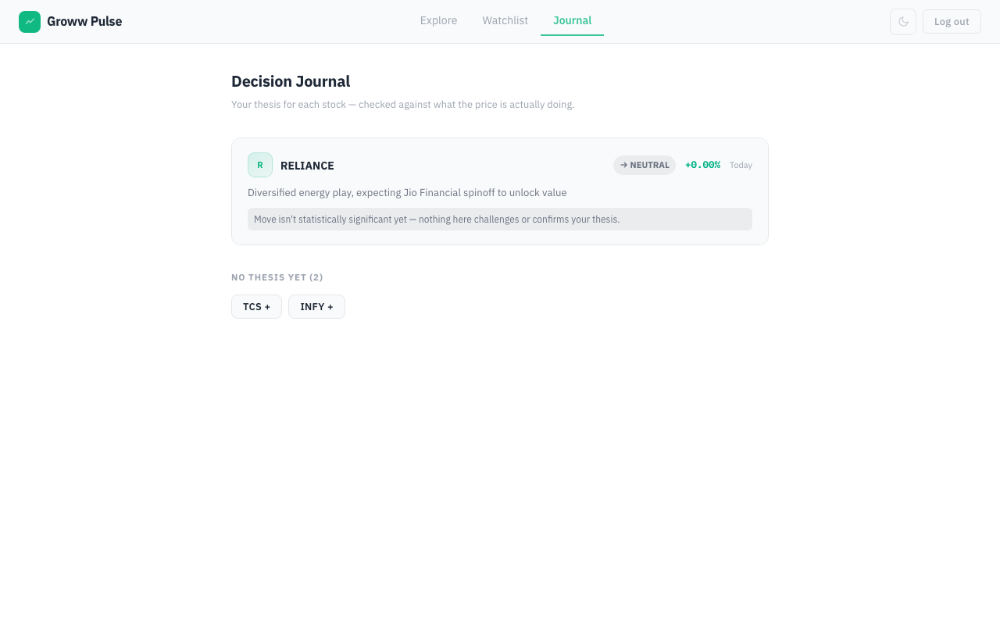
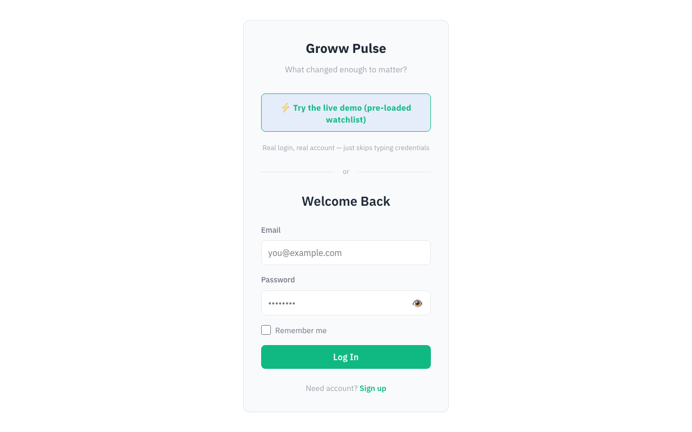

# Groww Pulse — Smart Stock Watchlist

**An intelligent watchlist companion for Groww users** that answers: *What changed enough to matter?*

Built for the **Code, by Groww** hackathon.

## Screenshots

| Explore | Watchlist |
|---------|-----------|
|  |  |

| Journal | Login |
|---------|-------|
|  |  |

---

## The Problem

Traditional watchlists treat all price movements equally. A 2% drop in volatile energy stock means nothing, but the same move in a normally-quiet IT stock could signal something real. Users waste time checking stocks that haven't meaningfully changed.

## The Solution

Groww Pulse uses **statistical attention scoring** to surface only what deserves your attention:

- **Z-score based scoring** — each move is weighted against that stock's own volatility and its sector's baseline
- **Second clock memory** — tracks when you last checked each stock, so a quiet stock that suddenly moves gets flagged even if the absolute change is small  
- **Sensitivity tuning** — mark stocks as Quiet (flag sooner), Normal, or Loud (flag less) based on your thesis
- **Decision journal** — record your thesis and track if the market proved you right

## Features

| Page | Purpose |
|------|---------|
| **Explore** | Market home: indices, top gainers/losers, your smart watchlist spotlight |
| **Watchlist** | AttentionDeck (narrative cards for flagged stocks), table with priority filtering, sensitivity controls, portfolio risk |
| **Journal** | Thesis tracker with SUPPORTED/CHALLENGED/NEUTRAL verdicts auto-evaluated against price action |

## How It Works

1. **Z-score calculation** — `(current_change - mean_change) / std_dev` for each stock
2. **Sector adjustment** — dampen signal if entire sector moved similarly
3. **Sensitivity multiplier** — apply user's preference: `{quiet: 1.75, normal: 1.0, loud: 0.6}`
4. **Time factor** — weight by how long since user last checked (second clock)
5. **Classification** — HIGH (z > 2.0), MEDIUM (z > 1.0), LOW (z ≤ 1.0)

**Result:** Only statistically unusual moves surface. A quiet IT stock twitching 1.5% (when IT normally moves 0.3%) ranks higher than an energy stock dropping 3% (when energy regularly swings 4%).

## Architecture

```
                    http://localhost
                           ↓
                 ┌──────────────────┐
                 │  nginx (port 80) │
                 │ static + /api    │
                 │ + /ws proxying   │
                 └─────────┬────────┘
                      ┌────┴─────┐
                      ↓          ↓
              ┌─────────────┐  ┌──────────────┐
              │   React +   │  │   FastAPI +  │
              │   Vite      │  │ SQLAlchemy   │
              │  (static)   │  │ (port 8001)  │
              └─────────────┘  └──────┬───────┘
                                     ↓
                              ┌─────────────┐
                              │ PostgreSQL  │
                              │ (port 5432) │
                              └─────────────┘
```

**Stack:**
- Frontend: React 18 + TypeScript + Vite
- Backend: FastAPI + SQLAlchemy + JWT
- Database: PostgreSQL 15
- Deployment: Docker Compose + nginx

## Quick Start

### Option 1: Docker (Recommended)

```bash
docker compose up --build
```

Open [http://localhost](http://localhost).

### Option 2: Local Development

**Backend:**
```bash
cd backend
python -m venv venv && source venv/bin/activate
pip install -r requirements.txt
uvicorn main:app --port 8001 --reload
```

**Frontend (in another terminal):**
```bash
cd frontend
npm install
npm run dev  # starts on port 5180, proxies /api to backend
```

### Demo Credentials

```
Email: demo@groww.in
Password: demo1234
```

## Project Structure

```
groww-pulse/
├── backend/              # FastAPI server
│   ├── main.py          # App setup, middleware, lifespan
│   ├── models.py        # SQLAlchemy ORM models
│   ├── schemas.py       # Pydantic request/response schemas
│   ├── routers/         # Route handlers
│   │   ├── auth.py      # JWT login/register
│   │   ├── watchlist.py # Stock scoring & management
│   │   ├── markets.py   # Indices & movers
│   │   └── ws_router.py # WebSocket live updates
│   └── services/        # Business logic
│       ├── attention_score.py  # Z-score engine
│       ├── market_data.py      # Live price fetching
│       └── sector_service.py   # Sector lookups
│
├── frontend/            # React app
│   ├── src/
│   │   ├── pages/       # Explore, Watchlist, Journal
│   │   ├── components/  # AttentionDeck, MarketRail, NavBar
│   │   ├── hooks/       # useLiveBrief, useWatchlist
│   │   └── lib/         # API client, auth
│   ├── Dockerfile       # Multi-stage nginx build
│   └── nginx.conf       # Reverse proxy config
│
├── docker-compose.yml   # PostgreSQL + backend + frontend
└── README.md           # This file
```

## Security

- ✅ JWT authentication with configurable expiry
- ✅ Security headers (X-Content-Type-Options, X-Frame-Options, Referrer-Policy)
- ✅ Rate limiting (60 req/min per IP)
- ✅ CORS restricted to configured origin
- ✅ No hardcoded secrets — all config via environment variables
- ✅ Password hashing with bcrypt
- ✅ Database connection pooling

## API Routes

### Markets
- `GET /api/markets/indices` — latest NIFTY, SENSEX, etc.
- `GET /api/markets/movers` — top gainers and losers
- `GET /api/markets/symbol-metadata/{symbol}` — company info

### Watchlist
- `GET /api/watchlist` — user's watchlist with scores
- `POST /api/watchlist/add` — add stock to watchlist
- `DELETE /api/watchlist/{symbol}` — remove stock
- `PATCH /api/watchlist/{symbol}/sensitivity` — update sensitivity (quiet/normal/loud)
- `POST /api/watchlist/{symbol}/thesis` — record thesis
- `GET /api/watchlist/{symbol}/history` — price history for Time Machine

### Auth
- `POST /api/auth/register` — sign up
- `POST /api/auth/login` — sign in
- `GET /api/auth/me` — current user

### WebSocket
- `WS /ws/brief` — live watchlist updates

## Why This Wins

1. **Real insight** — most watchlists show noise (price %), we show signal (z-score vs your stock's behavior)
2. **Thesis tracking** — record why you're watching, journal verdicts against reality
3. **Clean UX** — Groww-inspired design, minimal nav, no clutter
4. **Production ready** — security headers, rate limiting, WebSocket, history pruning, migrations
5. **Extensible architecture** — easy to add alerts, backtesting, sector analysis, ML scoring

## License

MIT

---

**For the hackathon:** This is a fully-deployable feature that Groww could ship as a paid companion or free tier add-on. It teaches users that not all volatility is created equal, and gives them agency (sensitivity controls, theses) over their watchlist.
